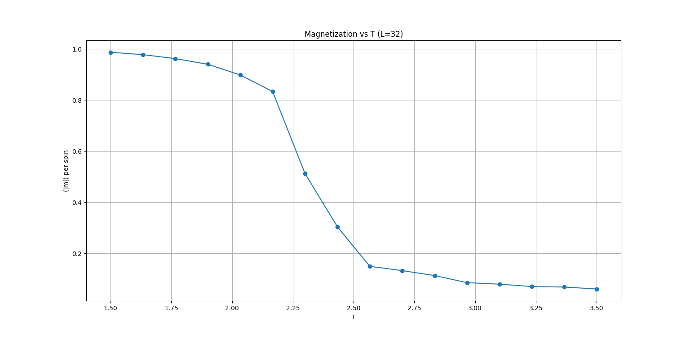
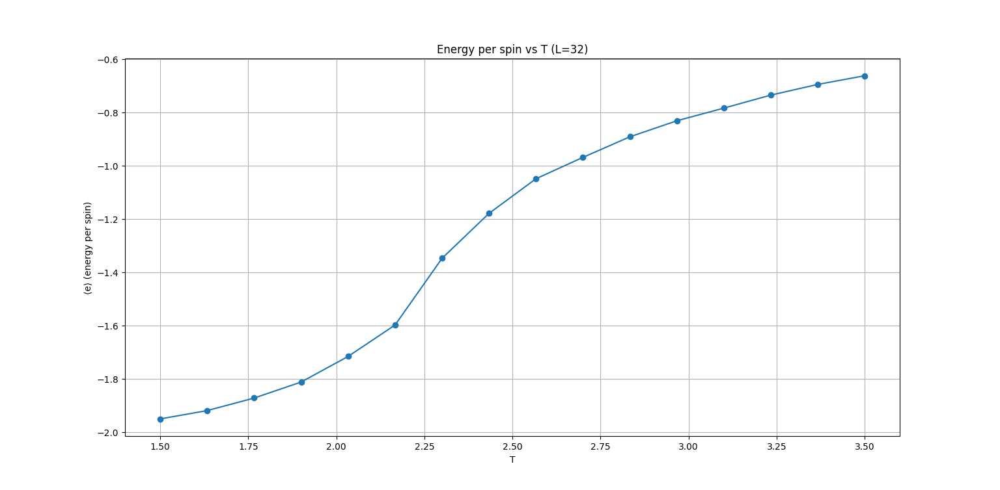
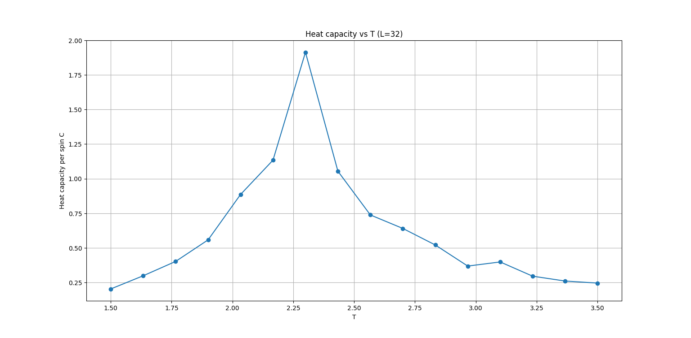
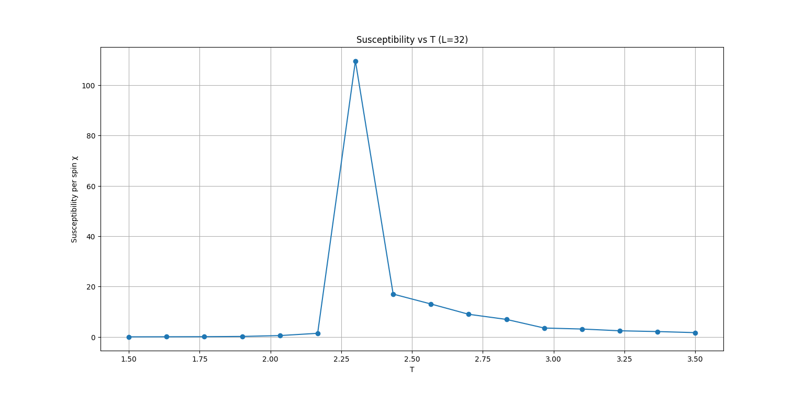
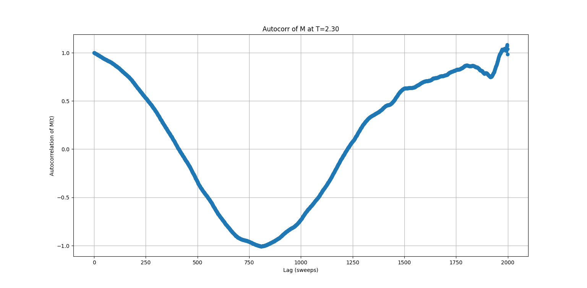

# 2D Ising Model Monte Carlo Simulation

This project simulates the 2D Ising model using the Metropolis algorithm and visualizes key thermodynamic observables as a function of temperature.

## Features
- Monte Carlo simulation of the 2D Ising model
- Plots for magnetization, energy, heat capacity, susceptibility, and autocorrelation
- Snapshots of spin configurations at selected temperatures

## Requirements
- Python 3.8+
- numpy
- matplotlib

## Usage
Run the simulation with:

```bash
python ising.py
```

Output plots and snapshots will be saved in the `ising_outputs` directory.

## Sample Output

| Magnetization vs T | Energy vs T | Heat Capacity vs T |
|-------------------|-------------|--------------------|
|  |  |  |

| Susceptibility vs T | Autocorrelation |
|---------------------|----------------|
|  |  |

## License
MIT License
